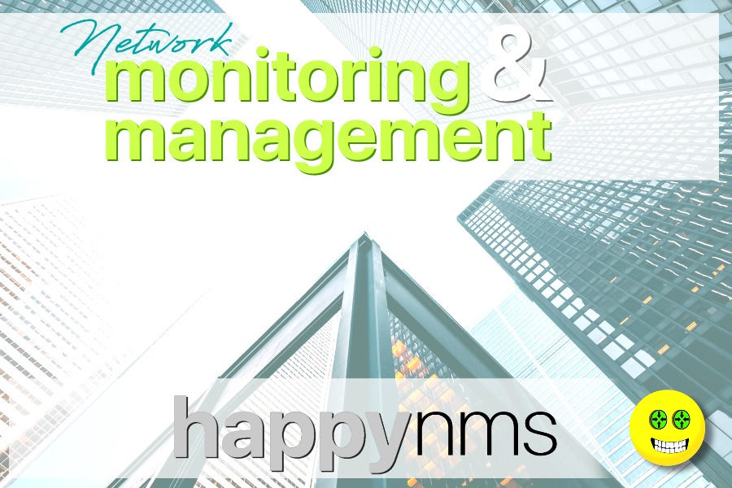

# happynms
An Open Source Network Monitoring & Management System

## Status

Currently Experimental.  Watch or Star this project to stay updated. 

## Monitoring Features

* Network Maps
* Device Uptime
* Interface Bandwidth Graphs
* Wireless Link Monitoring (RSL/SNR/Modulation)
* SNMP Graphs
* Service/Device/Network Outage Notification
* DNS Server/Record Monitoring
* Domain Registration & Renewal Monitoring

## Management Features

* Device Provisioning
* Network Inventory
* Configuration Management (Device Config Backups)
* IPAM (IP address management)

